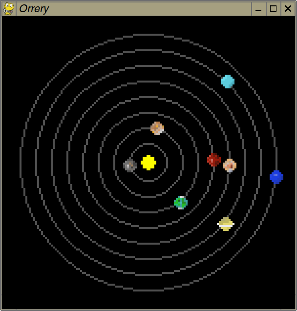

# An orrery in PyGame, based on code from [pico-solar-system](https://github.com/dr-mod/pico-solar-system)

In orrery.py and orrery_hd.py, orbits are approximated as concentric circles around the Sun.

The actual elliptical orbits are shown in orrery_real_orbits.py, which is particularly noticeable for the Mercury and Mars orbits. The planets leave trails in this program to show their orbits.

The Sun and planet images are not drawn to scale.

## Usage

Press **left and right cursor** keys to advance by a single day, **up and down cursor** keys to advance by 30 days, or **page up and down** to advance by 365 days.

Press **Return** to jump back to today's date; press **A** to toggle animation. In the HD version, **F** toggles fast animation speed.

In the HD version, pressing **D** toggles true distance mode where the orbits are drawn at their true average solar distances. Use **+ and -** to zoom in and out. Angles between planets are closer to reality in this view, especially if the outer planets are involved.

## Screenshots

Classic mode:

HD mode:

HD mode with true distance scaling enabled:

Real orbits:

## License

GPL

